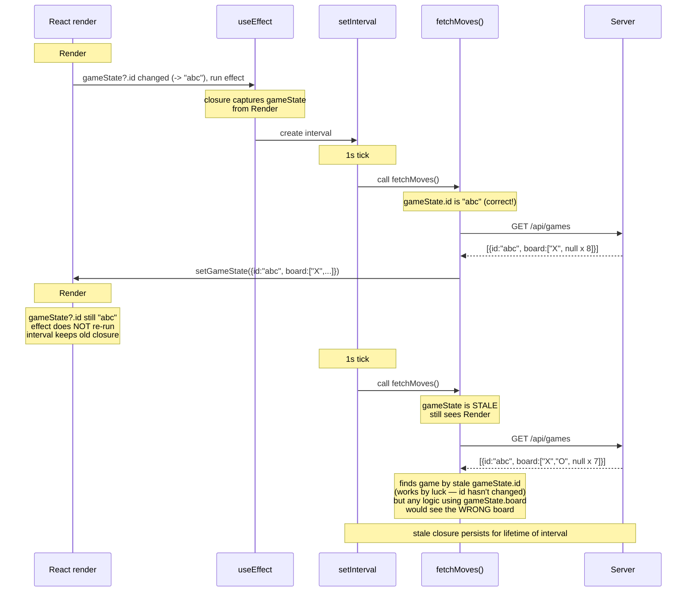
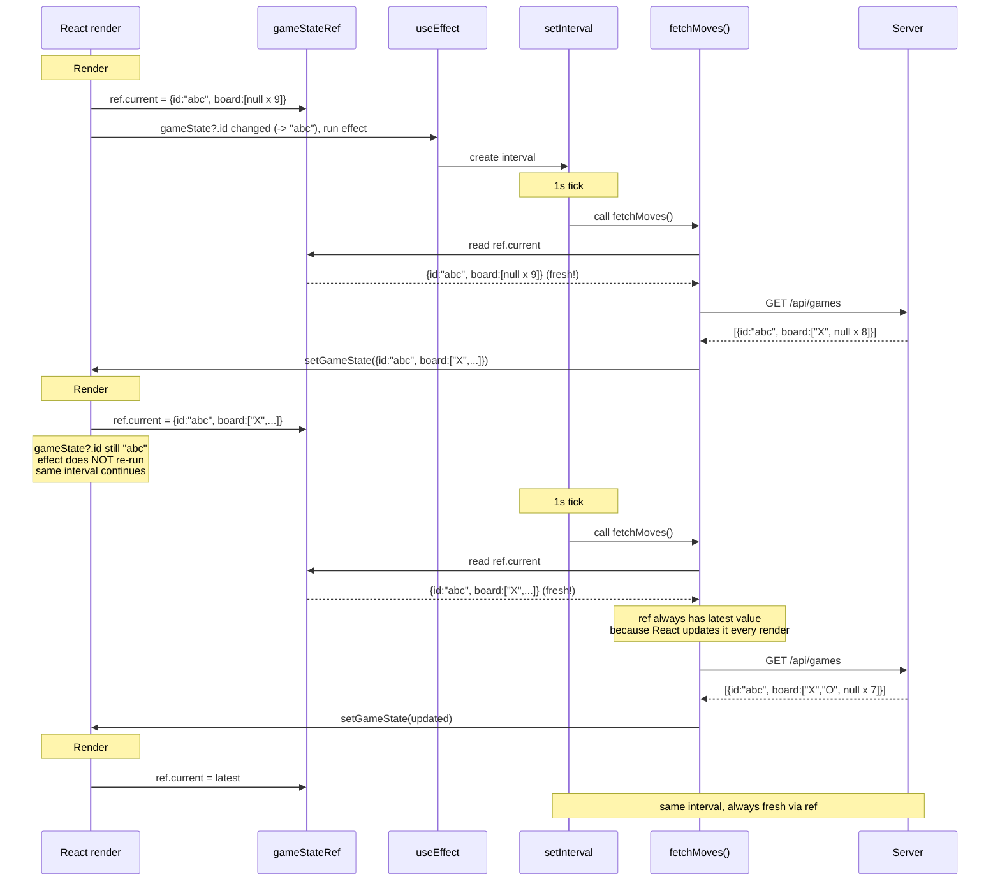
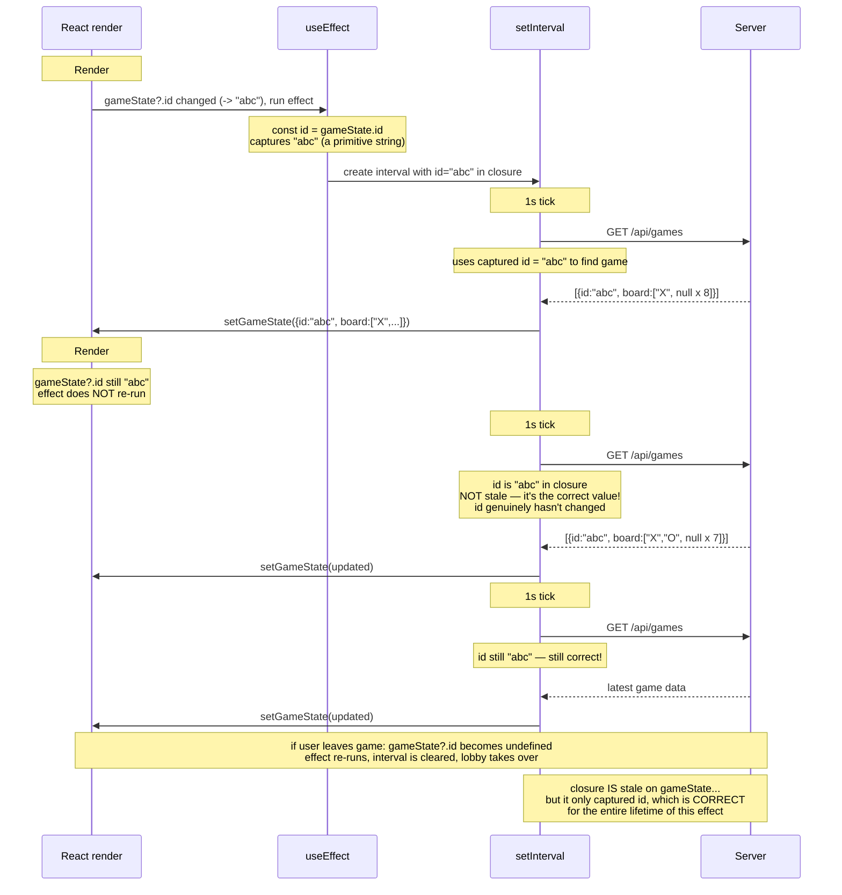

# fetchMoves Stale Closure: Three Approaches

## Diagram 1: No useRef — Stale Closure Bug

The effect runs when `gameState?.id` becomes `"abc"`. Inside `fetchMoves`, `gameState` is captured from that render. But `fetchMoves` is defined in component scope and closes over the `gameState` from the render when the effect ran — it's stale on subsequent ticks.

**The bug**: `fetchMoves` closes over `gameState` from the render when the effect created the interval. On subsequent ticks, `gameState` inside the closure is frozen at that old value. It happens to work for `id` (which doesn't change), but the closure is fundamentally stale.

---

## Diagram 2: useRef — Escape the Closure

`gameStateRef.current` is mutated on every render, so the interval callback always reads the latest value regardless of when it was created.

**How it works**: The ref is a mutable box that lives outside React's render cycle. Writing `gameStateRef.current = gameState` on every render keeps it fresh. The interval callback reads from the box instead of its stale closure.

---

## Diagram 3: Stable gameId — No Ref Needed

Key insight: the only thing `fetchMoves` needs from `gameState` is the `id`. And `id` doesn't change within the effect's lifetime (the effect re-runs when `gameState?.id` changes). So just capture `id` directly.

**Why this works**: The closure _is_ technically stale (it captured Render #1's scope). But it only uses `id`, which is a primitive that doesn't change until the effect is torn down and re-created. The "staleness" is harmless because the captured value is guaranteed to be correct.

---

## Side-by-Side Summary

```mermaid
flowchart TD
    subgraph A["1: No useRef (stale)"]
        A1["fetchMoves closes over<br/>gameState from Render #1"]
        A2["interval ticks, gameState<br/>is frozen at old value"]
        A3["works by luck for .id<br/>but closure is fundamentally stale"]
        A1 --> A2 --> A3
    end

    subgraph B["2: useRef (not stale)"]
        B1["ref.current updated<br/>every render"]
        B2["interval reads ref.current<br/>instead of closed-over variable"]
        B3["always fresh, but React<br/>can't see the dependency"]
        B1 --> B2 --> B3
    end

    subgraph C["3: Capture id (no ref needed)"]
        C1["const id = gameState.id<br/>captured at effect creation"]
        C2["interval uses id (primitive)<br/>which never changes"]
        C3["closure is stale but<br/>captured value is correct"]
        C1 --> C2 --> C3
    end
```

