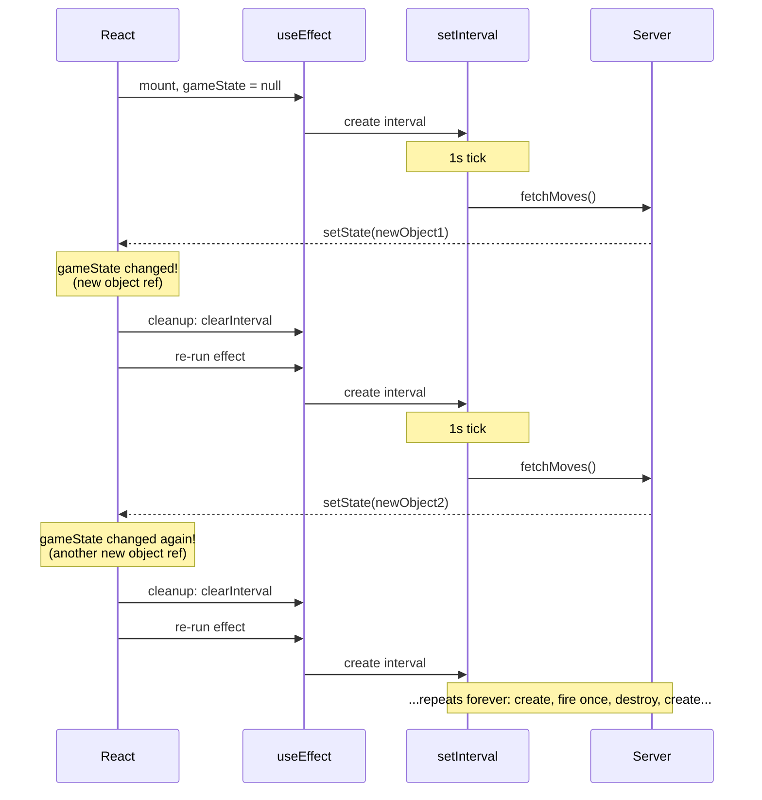
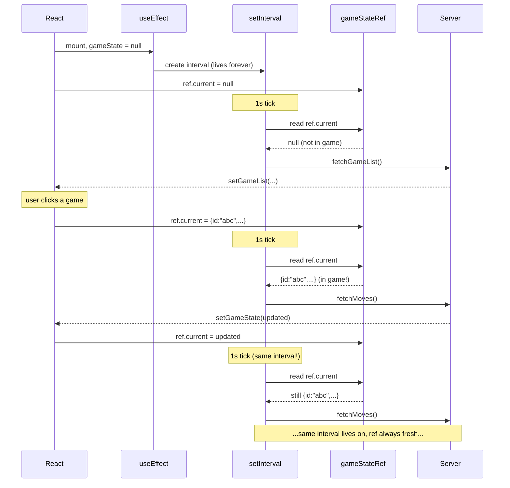
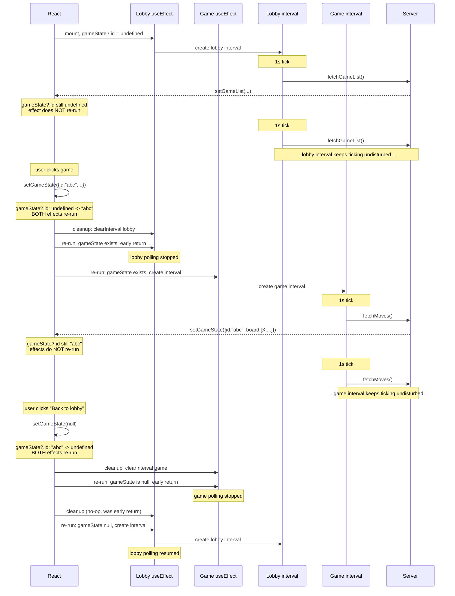
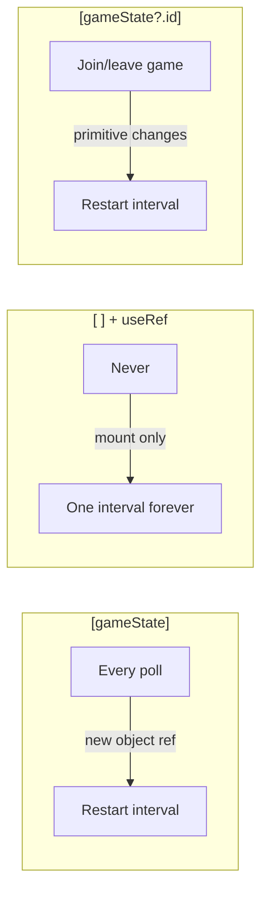

# useEffect + setInterval Timing Diagrams

## Diagram 1: The Problem — `[gameState]` as dependency (interval churn)

Every poll returns a new object reference, so React tears down and re-creates the interval every second.

**Problem**: The interval never survives more than one tick. React sees a "new" dependency every time because `{id:"abc", board:[...]}  !== {id:"abc", board:[...]}` (different object references).

---

## Diagram 2: The Escape Hatch — `[]` deps + useRef guard

The interval is created once and lives forever. It peeks at `gameStateRef.current` to decide what to do.

**Tradeoff**: Works, but React has no visibility into dependencies. The ref is a "backdoor" — React doesn't know the interval cares about gameState. You're managing the lifecycle yourself.

---

## Diagram 3: The Insight — `[gameState?.id]` as dependency (stable primitive)

The interval is re-created only at meaningful transitions (null <-> "abc-123"), not on every poll.

**Why it works**: `gameState?.id` is a string/undefined — a primitive. It evaluates to the same value across polls (`"abc" === "abc"`), so React doesn't see a change. It only changes at real transitions: joining a game (`undefined` -> `"abc"`) or leaving (`"abc"` -> `undefined`).

---

## Summary: When does the interval restart?

