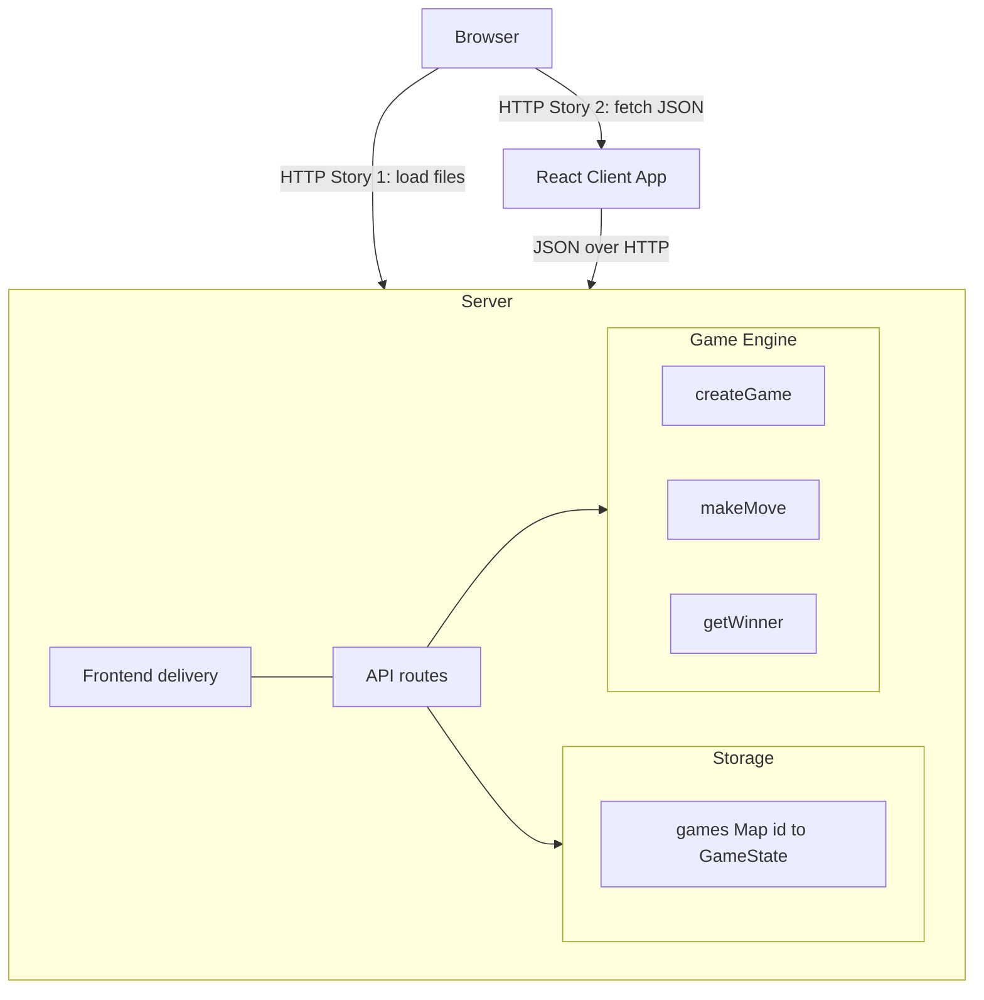

Legend:
- HTTP Story 1 = Browser loads HTML/CSS/JS (Vite in dev, dist in prod)
- HTTP Story 2 = Client fetches JSON from /api/*
- API routes:
  - GET /api/games
  - POST /api/create
  - POST /api/move
- Storage is in-memory Map (wiped on restart)
- Winner is derived via getWinner, not stored